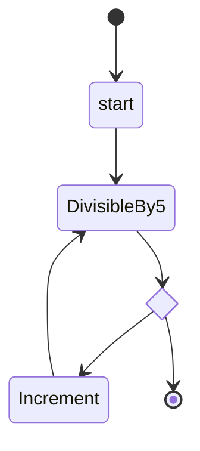
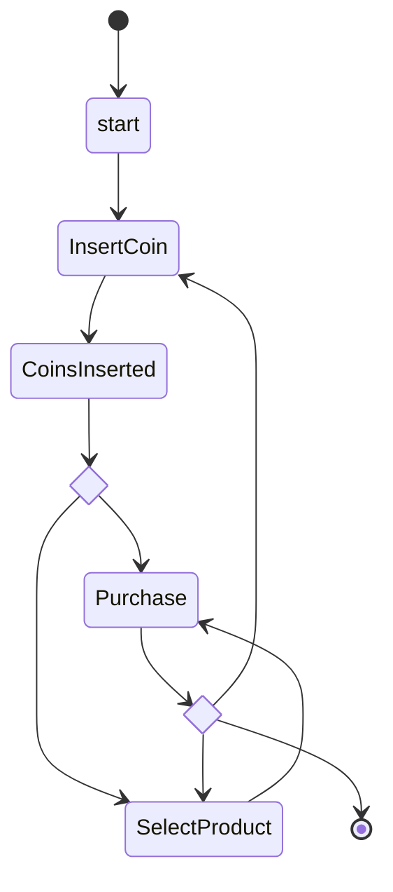
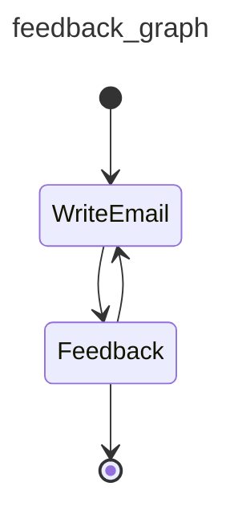

# Graphs

!!! danger "Don't use a nail gun unless you need a nail gun"
    If Pydantic AI [agents](agent.md) are a hammer, and [multi-agent workflows](multi-agent-applications.md) are a sledgehammer, then graphs are a nail gun:

    * sure, nail guns look cooler than hammers
    * but nail guns take a lot more setup than hammers
    * and nail guns don't make you a better builder, they make you a builder with a nail gun
    * Lastly, (and at the risk of torturing this metaphor), if you're a fan of medieval tools like mallets and untyped Python, you probably won't like nail guns or our approach to graphs. (But then again, if you're not a fan of type hints in Python, you've probably already bounced off Pydantic AI to use one of the toy agent frameworks — good luck, and feel free to borrow my sledgehammer when you realize you need it)

    In short, graphs are a powerful tool, but they're not the right tool for every job. Please consider other [multi-agent approaches](multi-agent-applications.md) before proceeding.

    If you're not confident a graph-based approach is a good idea, it might be unnecessary.

Graphs and finite state machines (FSMs) are a powerful abstraction to model, execute, control and visualize complex workflows.

Alongside Pydantic AI, we've developed `pydantic-graph` — an async graph and state machine library for Python where nodes and edges are defined using type hints.

While this library is developed as part of Pydantic AI; it has no dependency on `pydantic-ai` and can be considered as a pure graph-based state machine library. You may find it useful whether or not you're using Pydantic AI or even building with GenAI.

`pydantic-graph` is designed for advanced users and makes heavy use of Python generics and type hints. It is not designed to be as beginner-friendly as Pydantic AI.

## Installation

`pydantic-graph` is a required dependency of `pydantic-ai`, and an optional dependency of `pydantic-ai-slim`, see [installation instructions](install.md#slim-install) for more information. You can also install it directly:

```bash
pip/uv-add pydantic-graph
```

## Graph Types

`pydantic-graph` is made up of a few key components:

### GraphRunContext

[`GraphRunContext`][pydantic_graph.basenode.GraphRunContext] — The context for the graph run, similar to Pydantic AI's [`RunContext`][pydantic_ai.tools.RunContext]. This holds the state of the graph and dependencies and is passed to nodes when they're run.

`GraphRunContext` is generic in the state type of the graph it's used in, [`StateT`][pydantic_graph.basenode.StateT].

### End

[`End`][pydantic_graph.basenode.End] — return value to indicate the graph run should end.

`End` is generic in the graph return type of the graph it's used in, [`RunEndT`][pydantic_graph.basenode.RunEndT].

### Nodes

Subclasses of [`BaseNode`][pydantic_graph.basenode.BaseNode] define nodes for execution in the graph.

Nodes, which are generally [`dataclass`es][dataclasses.dataclass], generally consist of:

- fields containing any parameters required/optional when calling the node
- the business logic to execute the node, in the [`run`][pydantic_graph.basenode.BaseNode.run] method
- return annotations of the [`run`][pydantic_graph.basenode.BaseNode.run] method, which are read by `pydantic-graph` to determine the outgoing edges of the node

Nodes are generic in:

- **state**, which must have the same type as the state of graphs they're included in, [`StateT`][pydantic_graph.basenode.StateT] has a default of `None`, so if you're not using state you can omit this generic parameter, see [stateful graphs](#stateful-graphs) for more information
- **deps**, which must have the same type as the deps of the graph they're included in, [`DepsT`][pydantic_graph.basenode.DepsT] has a default of `None`, so if you're not using deps you can omit this generic parameter, see [dependency injection](#dependency-injection) for more information
- **graph return type** — this only applies if the node returns [`End`][pydantic_graph.basenode.End]. [`RunEndT`][pydantic_graph.basenode.RunEndT] has a default of [Never][typing.Never] so this generic parameter can be omitted if the node doesn't return `End`, but must be included if it does.

Here's an example of a start or intermediate node in a graph — it can't end the run as it doesn't return [`End`][pydantic_graph.basenode.End]:

```py {title="intermediate_node.py" noqa="F821" test="skip"}
from dataclasses import dataclass

from pydantic_graph import BaseNode, GraphRunContext


@dataclass
class MyNode(BaseNode[MyState]):  # (1)!
    foo: int  # (2)!

    async def run(
        self,
        ctx: GraphRunContext[MyState],  # (3)!
    ) -> AnotherNode:  # (4)!
        ...
        return AnotherNode()
```

1. State in this example is `MyState` (not shown), hence `BaseNode` is parameterized with `MyState`. This node can't end the run, so the `RunEndT` generic parameter is omitted and defaults to `Never`.
2. `MyNode` is a dataclass and has a single field `foo`, an `int`.
3. The `run` method takes a `GraphRunContext` parameter, again parameterized with state `MyState`.
4. The return type of the `run` method is `AnotherNode` (not shown), this is used to determine the outgoing edges of the node.

We could extend `MyNode` to optionally end the run if `foo` is divisible by 5:

```py {title="intermediate_or_end_node.py" hl_lines="7 13 15" noqa="F821" test="skip"}
from dataclasses import dataclass

from pydantic_graph import BaseNode, End, GraphRunContext


@dataclass
class MyNode(BaseNode[MyState, None, int]):  # (1)!
    foo: int

    async def run(
        self,
        ctx: GraphRunContext[MyState],
    ) -> AnotherNode | End[int]:  # (2)!
        if self.foo % 5 == 0:
            return End(self.foo)
        else:
            return AnotherNode()
```

1. We parameterize the node with the return type (`int` in this case) as well as state. Because generic parameters are positional-only, we have to include `None` as the second parameter representing deps.
2. The return type of the `run` method is now a union of `AnotherNode` and `End[int]`, this allows the node to end the run if `foo` is divisible by 5.

### Graph

[`Graph`][pydantic_graph.graph_builder.Graph] — the executable graph produced by a [`GraphBuilder`][pydantic_graph.graph_builder.GraphBuilder]. The builder is the entry point for assembling a graph from [step functions](graph/builder/steps.md), [`BaseNode`](#nodes) classes, and the edges connecting them.

[`GraphBuilder`][pydantic_graph.graph_builder.GraphBuilder] is generic in:

- **state** the state type of the graph, [`StateT`][pydantic_graph.basenode.StateT]
- **deps** the deps type of the graph, [`DepsT`][pydantic_graph.basenode.DepsT]
- **input** the type of the initial input passed to the graph, `InputT`
- **output** the type of the final output produced by the graph, `OutputT`

Here's an example of a simple graph built from two `BaseNode` subclasses:

```py {title="graph_example.py"}
from __future__ import annotations

from dataclasses import dataclass

from pydantic_graph import BaseNode, End, GraphBuilder, GraphRunContext, StepContext


@dataclass
class DivisibleBy5(BaseNode[None, None, int]):  # (1)!
    foo: int

    async def run(
        self,
        ctx: GraphRunContext,
    ) -> Increment | End[int]:
        if self.foo % 5 == 0:
            return End(self.foo)
        else:
            return Increment(self.foo)


@dataclass
class Increment(BaseNode):  # (2)!
    foo: int

    async def run(self, ctx: GraphRunContext) -> DivisibleBy5:
        return DivisibleBy5(self.foo + 1)


g = GraphBuilder(input_type=int, output_type=int)  # (3)!


@g.step
async def start(ctx: StepContext[None, None, int]) -> DivisibleBy5:  # (4)!
    return DivisibleBy5(ctx.inputs)


g.add(
    g.node(DivisibleBy5),  # (5)!
    g.node(Increment),
    g.edge_from(g.start_node).to(start),  # (6)!
)

fives_graph = g.build()  # (7)!


async def main():
    result = await fives_graph.run(inputs=4)  # (8)!
    print(result)
    #> 5
```

1. The `DivisibleBy5` node is parameterized with `None` for the state param and `None` for the deps param as this graph doesn't use state or deps, and `int` as it can end the run.
2. The `Increment` node doesn't return `End`, so the `RunEndT` generic parameter is omitted, state can also be omitted as the graph doesn't use state.
3. Create a [`GraphBuilder`][pydantic_graph.graph_builder.GraphBuilder] declaring the input and output types of the graph.
4. Define a [step](graph/builder/steps.md) that wraps the initial input as the first `BaseNode`. The builder calls this when execution leaves [`g.start_node`][pydantic_graph.graph_builder.GraphBuilder.start_node].
5. Register each `BaseNode` subclass with [`g.node()`][pydantic_graph.graph_builder.GraphBuilder.node] so the builder knows about it; outgoing edges are inferred from each node's `run` return type.
6. Wire the start node into the entry step.
7. [`g.build()`][pydantic_graph.graph_builder.GraphBuilder.build] returns a [`Graph`][pydantic_graph.graph_builder.Graph] ready to execute.
8. [`graph.run()`][pydantic_graph.graph_builder.Graph.run] is async and returns the raw output value (the `int` returned by the `End` node).

_(This example is complete, it can be run "as is" — you'll need to add `import asyncio; asyncio.run(main())` to run `main`)_

A [mermaid diagram](#mermaid-diagrams) for this graph can be generated with `print(fives_graph)`, or by calling [`fives_graph.render()`][pydantic_graph.graph_builder.Graph.render]:



## Stateful Graphs

The "state" concept in `pydantic-graph` provides an optional way to access and mutate an object (often a `dataclass` or Pydantic model) as nodes run in a graph. If you think of Graphs as a production line, then your state is the engine being passed along the line and built up by each node as the graph is run.

Here's an example of a graph which represents a vending machine where the user may insert coins and select a product to purchase.

```python {title="vending_machine.py"}
from __future__ import annotations

from dataclasses import dataclass

from rich.prompt import Prompt

from pydantic_graph import BaseNode, End, GraphBuilder, GraphRunContext, StepContext


@dataclass
class MachineState:  # (1)!
    user_balance: float = 0.0
    product: str | None = None


@dataclass
class InsertCoin(BaseNode[MachineState]):  # (3)!
    async def run(self, ctx: GraphRunContext[MachineState]) -> CoinsInserted:  # (14)!
        return CoinsInserted(float(Prompt.ask('Insert coins')))  # (4)!


@dataclass
class CoinsInserted(BaseNode[MachineState]):
    amount: float  # (5)!

    async def run(
        self, ctx: GraphRunContext[MachineState]
    ) -> SelectProduct | Purchase:  # (15)!
        ctx.state.user_balance += self.amount  # (6)!
        if ctx.state.product is not None:  # (7)!
            return Purchase(ctx.state.product)
        else:
            return SelectProduct()


@dataclass
class SelectProduct(BaseNode[MachineState]):
    async def run(self, ctx: GraphRunContext[MachineState]) -> Purchase:
        return Purchase(Prompt.ask('Select product'))


PRODUCT_PRICES = {  # (2)!
    'water': 1.25,
    'soda': 1.50,
    'crisps': 1.75,
    'chocolate': 2.00,
}


@dataclass
class Purchase(BaseNode[MachineState, None, None]):  # (16)!
    product: str

    async def run(
        self, ctx: GraphRunContext[MachineState]
    ) -> End | InsertCoin | SelectProduct:
        if price := PRODUCT_PRICES.get(self.product):  # (8)!
            ctx.state.product = self.product  # (9)!
            if ctx.state.user_balance >= price:  # (10)!
                ctx.state.user_balance -= price
                return End(None)
            else:
                diff = price - ctx.state.user_balance
                print(f'Not enough money for {self.product}, need {diff:0.2f} more')
                #> Not enough money for crisps, need 0.75 more
                return InsertCoin()  # (11)!
        else:
            print(f'No such product: {self.product}, try again')
            return SelectProduct()  # (12)!


g = GraphBuilder(state_type=MachineState)  # (13)!


@g.step
async def start(ctx: StepContext[MachineState, None, None]) -> InsertCoin:
    return InsertCoin()


g.add(
    g.node(InsertCoin),
    g.node(CoinsInserted),
    g.node(SelectProduct),
    g.node(Purchase),
    g.edge_from(g.start_node).to(start),
)

vending_machine_graph = g.build()


async def main():
    state = MachineState()  # (17)!
    await vending_machine_graph.run(state=state)  # (18)!
    print(f'purchase successful item={state.product} change={state.user_balance:0.2f}')
    #> purchase successful item=crisps change=0.25
```

1. The state of the vending machine is defined as a dataclass with the user's balance and the product they've selected, if any.
2. A dictionary of products mapped to prices.
3. The `InsertCoin` node, [`BaseNode`][pydantic_graph.basenode.BaseNode] is parameterized with `MachineState` as that's the state used in this graph.
4. The `InsertCoin` node prompts the user to insert coins. We keep things simple by just entering a monetary amount as a float.
5. The `CoinsInserted` node; again this is a [`dataclass`][dataclasses.dataclass] with one field `amount`.
6. Update the user's balance with the amount inserted.
7. If the user has already selected a product, go to `Purchase`, otherwise go to `SelectProduct`.
8. In the `Purchase` node, look up the price of the product if the user entered a valid product.
9. If the user did enter a valid product, set the product in the state so we don't revisit `SelectProduct`.
10. If the balance is enough to purchase the product, adjust the balance to reflect the purchase and return [`End`][pydantic_graph.basenode.End] to end the graph. We're not using the run return type, so we call `End` with `None`.
11. If the balance is insufficient, go to `InsertCoin` to prompt the user to insert more coins.
12. If the product is invalid, go to `SelectProduct` to prompt the user to select a product again.
13. Build the graph with [`GraphBuilder`][pydantic_graph.graph_builder.GraphBuilder], declaring the `MachineState` type. Each `BaseNode` subclass is registered with [`g.node()`][pydantic_graph.graph_builder.GraphBuilder.node]; outgoing edges are inferred from the `run` return types. The `start` step constructs the first node.
14. The return type of the node's [`run`][pydantic_graph.basenode.BaseNode.run] method is important as it is used to determine the outgoing edges of the node. This information in turn is used to render [mermaid diagrams](#mermaid-diagrams) and is enforced at runtime to detect misbehavior as soon as possible.
15. The return type of `CoinsInserted`'s [`run`][pydantic_graph.basenode.BaseNode.run] method is a union, meaning multiple outgoing edges are possible.
16. Unlike other nodes, `Purchase` can end the run, so the [`RunEndT`][pydantic_graph.basenode.RunEndT] generic parameter must be set. In this case it's `None` since the graph run return type is `None`.
17. Initialize the state. This will be passed to the graph run and mutated as the graph runs.
18. Run the graph with the initial state. The first node to execute is determined by the `start` step we wired into [`g.start_node`][pydantic_graph.graph_builder.GraphBuilder.start_node].

_(This example is complete, it can be run "as is" — you'll need to add `import asyncio; asyncio.run(main())` to run `main`)_

A [mermaid diagram](#mermaid-diagrams) for this graph can be generated with `print(vending_machine_graph)`:



See [below](#mermaid-diagrams) for more information on generating diagrams.

## GenAI Example

So far we haven't shown an example of a Graph that actually uses Pydantic AI or GenAI at all.

In this example, one agent generates a welcome email to a user and the other agent provides feedback on the email.

This graph has a very simple structure:



```python {title="genai_email_feedback.py"}
from __future__ import annotations as _annotations

from dataclasses import dataclass, field

from pydantic import BaseModel, EmailStr

from pydantic_ai import Agent, ModelMessage, format_as_xml
from pydantic_graph import BaseNode, End, GraphBuilder, GraphRunContext, StepContext


@dataclass
class User:
    name: str
    email: EmailStr
    interests: list[str]


@dataclass
class Email:
    subject: str
    body: str


@dataclass
class State:
    user: User
    write_agent_messages: list[ModelMessage] = field(default_factory=list)


email_writer_agent = Agent(
    'google:gemini-3-pro-preview',
    output_type=Email,
    instructions='Write a welcome email to our tech blog.',
)


@dataclass
class WriteEmail(BaseNode[State]):
    email_feedback: str | None = None

    async def run(self, ctx: GraphRunContext[State]) -> Feedback:
        if self.email_feedback:
            prompt = (
                f'Rewrite the email for the user:\n'
                f'{format_as_xml(ctx.state.user)}\n'
                f'Feedback: {self.email_feedback}'
            )
        else:
            prompt = (
                f'Write a welcome email for the user:\n'
                f'{format_as_xml(ctx.state.user)}'
            )

        result = await email_writer_agent.run(
            prompt,
            message_history=ctx.state.write_agent_messages,
        )
        ctx.state.write_agent_messages += result.new_messages()
        return Feedback(result.output)


class EmailRequiresWrite(BaseModel):
    feedback: str


class EmailOk(BaseModel):
    pass


feedback_agent = Agent[None, EmailRequiresWrite | EmailOk](
    'openai:gpt-5.2',
    output_type=EmailRequiresWrite | EmailOk,  # type: ignore
    instructions=(
        'Review the email and provide feedback, email must reference the users specific interests.'
    ),
)


@dataclass
class Feedback(BaseNode[State, None, Email]):
    email: Email

    async def run(
        self,
        ctx: GraphRunContext[State],
    ) -> WriteEmail | End[Email]:
        prompt = format_as_xml({'user': ctx.state.user, 'email': self.email})
        result = await feedback_agent.run(prompt)
        if isinstance(result.output, EmailRequiresWrite):
            return WriteEmail(email_feedback=result.output.feedback)
        else:
            return End(self.email)


g = GraphBuilder(state_type=State, output_type=Email)


@g.step
async def start(ctx: StepContext[State, None, None]) -> WriteEmail:
    return WriteEmail()


g.add(
    g.node(WriteEmail),
    g.node(Feedback),
    g.edge_from(g.start_node).to(start),
)

feedback_graph = g.build()


async def main():
    user = User(
        name='John Doe',
        email='john.joe@example.com',
        interests=['Haskel', 'Lisp', 'Fortran'],
    )
    state = State(user)
    result = await feedback_graph.run(state=state)
    print(result)
    """
    Email(
        subject='Welcome to our tech blog!',
        body='Hello John, Welcome to our tech blog! ...',
    )
    """
```

_(This example is complete, it can be run "as is" — you'll need to add `asyncio.run(main())` to run `main`)_

## Iterating Over a Graph

For step-by-step execution — inspecting each task as it runs, overriding the next step, or driving the loop manually — use [`graph.iter()`][pydantic_graph.graph_builder.Graph.iter] instead of [`graph.run()`][pydantic_graph.graph_builder.Graph.run]. See [Advanced Execution Control](graph/builder/index.md#advanced-execution-control) in the graph builder docs for the iteration model and examples.

## Dependency Injection

As with Pydantic AI, `pydantic-graph` supports dependency injection. Pass a `deps_type` to [`GraphBuilder`][pydantic_graph.graph_builder.GraphBuilder], parameterize each [`BaseNode`][pydantic_graph.basenode.BaseNode] subclass with the deps type, and read it via [`GraphRunContext.deps`][pydantic_graph.basenode.GraphRunContext.deps] inside `run()` (or [`StepContext.deps`][pydantic_graph.step.StepContext] inside step functions).

As an example, let's modify the `DivisibleBy5` example [above](#graph) to use a [`ProcessPoolExecutor`][concurrent.futures.ProcessPoolExecutor] to run the compute load in a separate process (this is a contrived example, `ProcessPoolExecutor` wouldn't actually improve performance in this example):

```py {title="deps_example.py" test="skip" hl_lines="4 8 14-16 39-44 49 56-58"}
from __future__ import annotations

import asyncio
from concurrent.futures import ProcessPoolExecutor
from dataclasses import dataclass

from pydantic_graph import BaseNode, End, GraphBuilder, GraphRunContext, StepContext


@dataclass
class GraphDeps:
    executor: ProcessPoolExecutor


@dataclass
class DivisibleBy5(BaseNode[None, GraphDeps, int]):
    foo: int

    async def run(
        self,
        ctx: GraphRunContext[None, GraphDeps],
    ) -> Increment | End[int]:
        if self.foo % 5 == 0:
            return End(self.foo)
        else:
            return Increment(self.foo)


@dataclass
class Increment(BaseNode[None, GraphDeps]):
    foo: int

    async def run(self, ctx: GraphRunContext[None, GraphDeps]) -> DivisibleBy5:
        loop = asyncio.get_running_loop()
        compute_result = await loop.run_in_executor(
            ctx.deps.executor,
            self.compute,
        )
        return DivisibleBy5(compute_result)

    def compute(self) -> int:
        return self.foo + 1


g = GraphBuilder(deps_type=GraphDeps, input_type=int, output_type=int)


@g.step
async def start(ctx: StepContext[None, GraphDeps, int]) -> DivisibleBy5:
    return DivisibleBy5(ctx.inputs)


g.add(
    g.node(DivisibleBy5),
    g.node(Increment),
    g.edge_from(g.start_node).to(start),
)

fives_graph = g.build()


async def main():
    with ProcessPoolExecutor() as executor:
        deps = GraphDeps(executor)
        result = await fives_graph.run(inputs=3, deps=deps)
    print(result)
    #> 5
```

_(This example is complete, it can be run "as is" — you'll need to add `asyncio.run(main())` to run `main`)_

## Mermaid Diagrams

Pydantic Graph can render [mermaid](https://mermaid.js.org/) [`stateDiagram-v2`](https://mermaid.js.org/syntax/stateDiagram.html) diagrams for any built graph. Call [`graph.render()`][pydantic_graph.graph_builder.Graph.render] (or just `print(graph)`) to get the mermaid source — pass `direction` (`'TB'`, `'LR'`, `'RL'`, or `'BT'`) to control layout. See the [graph builder mermaid section](graph/builder/index.md#mermaid-diagrams) for the full set of rendering options.
